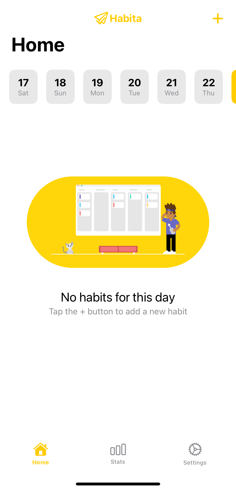

# Habita - iOS Habit Tracker App

  

## Table of Contents
- 🚀 [Project Overview](#project-overview)
- ✨ [Features](#features)
- 💻 [Technologies](#technologies)
- 📋 [Requirements](#requirements)
- 🛠️ [Setup Instructions](#setup-instructions)
- 📸 [Screenshots](#screenshots)

## Project Overview
Habita is an iOS app designed for tracking and managing habits, helping users achieve their personal goals by documenting progress and providing related statistics.
> [!NOTE]  
> The app is only available in the English language version!

## Features
- 🏠 Main view displaying habits as a list and allowing you to log their completion over the past week
- ✅ 3 types of habits to customize the app to your needs (qualitative, quantitative and scalable)
- 🔥 Streak counter tracking how many days in a row you’ve successfully completed each habit
- 📆 Calendar showing your habit completion status over the last 30 days
- 📊 Various charts and stats to analyze your progress
- 🌙 Dark mode of the application 

## Technologies
- Swift programming language
- Swift Charts framework
- Core Data

## Requirements
Software versions used for development:
- Xcode 15.4+
- iOS 15+ device
> [!WARNING]  
> Compatibility with earlier versions has not been tested.

## Setup Instructions
(The application is not available on App Store at this time)

You will need a macOS computer with Xcode installed to run the application.

1. Download this repository.
2. Extract folder and open `Habita.xcodeproj` file.
3. Connect your iOS device to Xcode.
4. Enable Developer Mode on the iOS device (`Settings > Privacy & Security`).
5. "Trust" the developer's app in the settings on the iPhone (`Settings > General > VPN & Device Management`).
6. Install and open the app.

## Screenshots
 
 
 
 
 

